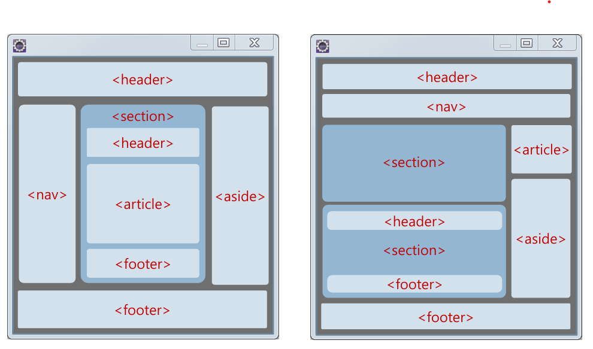

# 3주차 수업 요약

##  HTML과 HTML5
  - 기존 HTML은 표현하는데 한계가 있음
  - HTML5 의 시맨틱 태그로 구조화함

---

##  폼 작성 : 사용자의 입력을 처리하는 페이지
  - <mark>form</mark>: 예시) form name="fo" method ="get"
  - sction, text, button, input, label 등의 명령어가 있음 -> 책확인
  - <mark>placeholder</mark>="홍길동@wagyu.com : 이처럼 입력 예시를 표시
---

## 색 지정
  -  색 지정의 값들은 16진수로 , 0~256 가지의 색갈이 표현 가능하다.
---
## 시맨틱 블록 태그와 인라인태그
  블록 태그
  - <mark>figure</mark> :본문에 삽입되는 사진,차트 등 그림으로표현
  - <mark>details</mark>와 <mark>summary</mark> :상세정보와 그 모음집
    ### details,summary 사용예시
       details
         summary 서두 /summary
         내용들 기입
       /details
    
  - <mark>fieldset</mark>과<mark>legend</mark> : 태두리와 태두리에 이름 기입
     ### fieldset, legend 사용예시
        fieldset
          legend 테두리이름 /legend
        /fieldset
    
  인라인 태그
  - <mark>mark</mark> :중요한 텍스트임을 표시
  - <mark>time</mark> :텍스트의 내용이 시간임을 표시
  - <mark>meter</mark> :주어진 범위나 %의 데이터 량 표시
  - <mark>progress</mark> :작업의 진행 정도 표시
     
---

## Cascading style sheet / CSS (점진적 스타일 문서)
  - style 그룹을 따로 만들지 않고 인라인 테그에서 사용하는 방법
  - p style = "color : blue"; "font-size=400px"
  - style 과 인라인 테그중 우선 순위는 : <mark>인라인 테그</mark>
  
  - p > em 을 통해 style 양식 상속 가능
Q
